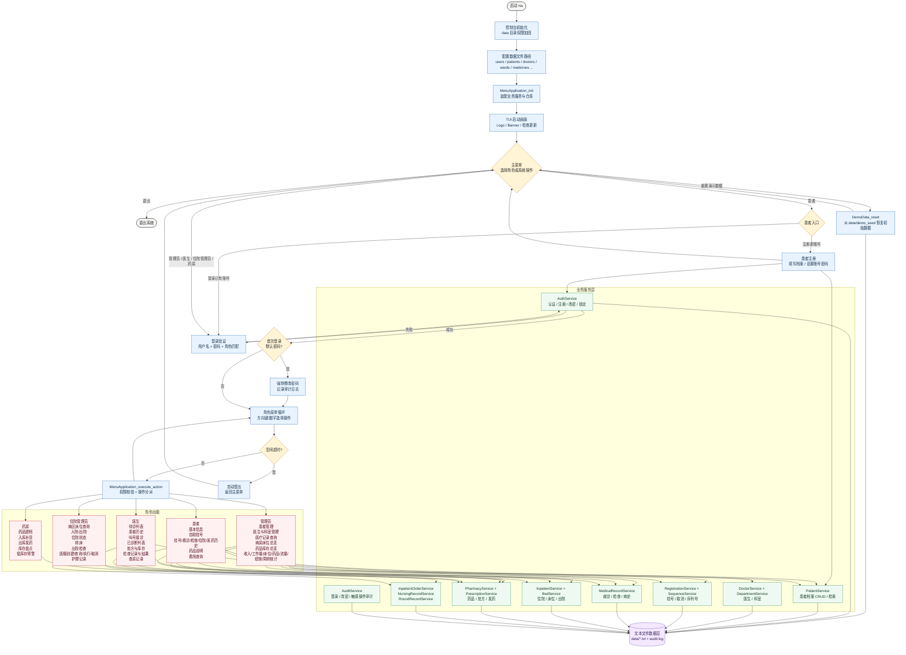
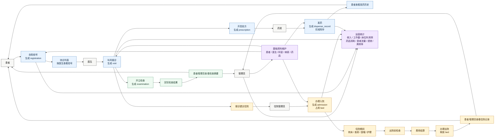
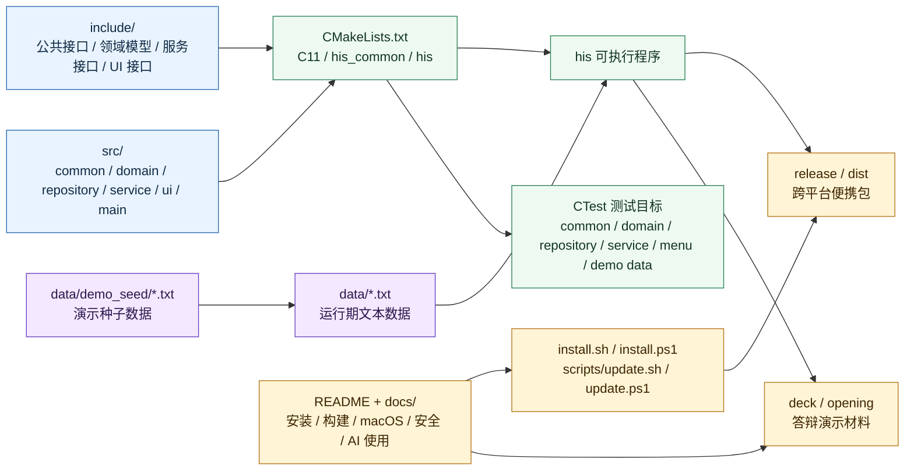

# HIS 项目流程图

## 系统总流程

## 核心业务闭环

## 工程组成与交付

## 数据文件覆盖

| 领域 | 文件 |
| --- | --- |
| 用户与患者 | `users.txt`, `patients.txt` |
| 医生与科室 | `doctors.txt`, `departments.txt` |
| 门诊 | `registrations.txt`, `visits.txt`, `examinations.txt`, `prescriptions.txt`, `dispense_records.txt` |
| 住院 | `wards.txt`, `beds.txt`, `admissions.txt`, `inpatient_orders.txt`, `nursing_records.txt`, `round_records.txt` |
| 药房 | `medicines.txt`, `prescriptions.txt`, `dispense_records.txt` |
| 系统 | `sequences.txt`, `audit.log`, `demo_seed/*.txt` |
