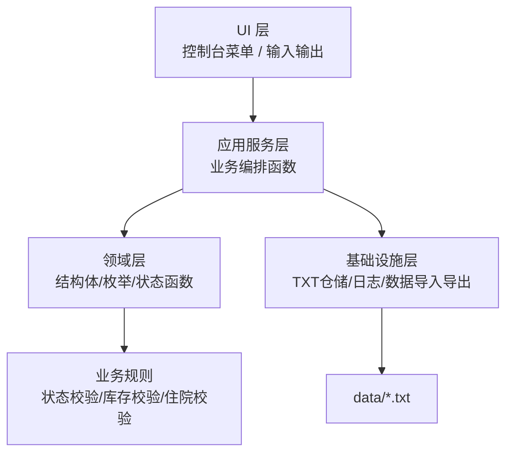
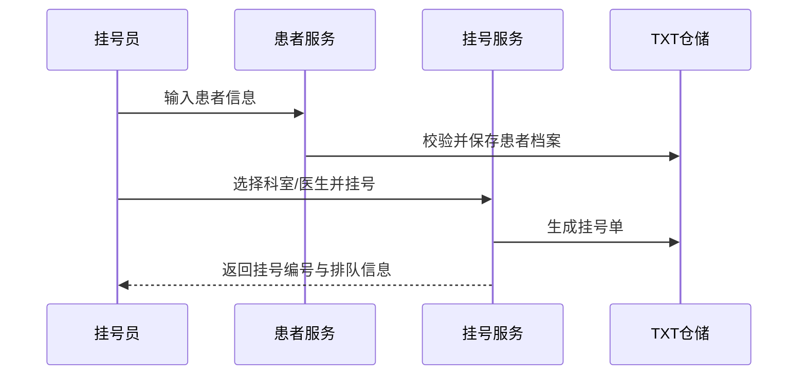
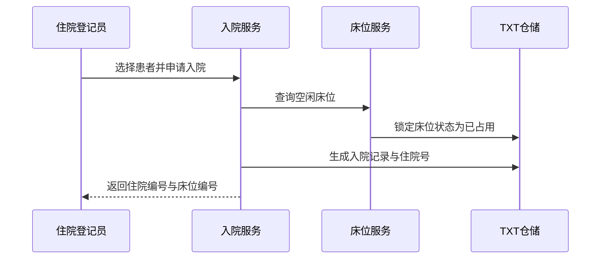

# 轻量级 HIS 课程设计规格说明

## 1. 项目定位

### 1.1 题意解读

题目要求围绕“小型医院的轻量级医疗管理系统（HIS）”完成课程设计，并特别强调以下四点：

1. 功能需要贴近真实业务，但规模应控制在课程设计可落地范围内。
2. 交互需要“人性化”，能够容忍不完整输入、误操作和多样查询需求。
3. 需要自行设计测试方案，并准备充足的 txt 原始数据文件用于现场评测。
4. 代码与模块划分要清晰，便于答辩演示、错误定位和后续扩展。

结合题面前半部分“测试工程师进酒吧”的隐喻，本方案将系统主题定义为：

> **鲁棒型门诊 + 基础住院 HIS**
>
> 重点不在“大而全”，而在于对异常输入、边界情况、库存一致性、业务闭环、床位状态和日志可追踪性的处理足够稳健。

### 1.2 默认技术假设

为满足“轻量级、易部署、便于现场评测”的要求，本文档采用以下默认技术路线：

- 开发语言：`C11`
- 运行方式：`单机控制台程序`
- 数据持久化：`txt 文本文件`
- 架构风格：`分层模块 + 结构体建模 + 过程式函数组织`
- 适用场景：`小型医院/社区门诊日常业务`

同时增加一条硬性实现约束：

- 所有系统源码、测试代码、数据初始化工具统一使用 `C 语言`
- 不引入 `C++` 类、模板、异常、STL，也不使用 `Java/Python` 编写核心实现
- 用于代码检查的 C 语言源程序需要包含必要代码注释
- 数据组织与核心容器实现需体现“全程链表实现”的课程要求

### 1.3 课程过程与交付约束

根据完整课题说明，除系统功能本身外，还需要同时满足以下课程过程要求：

- 班内自由分组，建议每组 `3-4` 人
- 第 3 次实验课前后需提交自拟题签
- 最后 2 次实验课需要进行代码检查和现场答辩
- 答辩前需提交总结报告，报告中应包含测试方案、成员分工与完成情况
- 评分不只看功能，还会综合考虑代码质量、报告质量、界面美观与人性化、个人和团队答辩表现

这意味着本项目交付物至少包含三部分：

- `纯 C 源码`
- `txt 原始数据文件`
- `总结报告/测试方案`

## 2. 建设目标与范围

### 2.1 建设目标

系统应支持一套可演示、可测试、可离线运行的“门诊 + 基础住院”业务闭环：

- 患者建档
- 挂号分诊
- 医生接诊与病历录入
- 处方开立
- 药房发药与库存扣减
- 入院登记
- 床位分配与床位状态维护
- 住院记录维护
- 出院办理与床位释放
- 查询统计与日志追踪

### 2.2 范围控制

本课程设计覆盖门诊核心流程与基础住院流程，但不纳入以下高复杂度能力：

- 手术排班
- 检验检查设备对接
- 分布式部署
- 多院区协同
- 护理排班与护理文书
- 长期医嘱执行闭环
- 病区药房联动和检验联动
- 复杂住院日清单与医保对账

这样可以保证项目控制在课程设计合理体量内，同时保留清晰演示价值。

### 2.3 课程硬性功能要求

结合你补充的 2025 级硬性要求，系统必须至少包含以下 5 个必做模块，并以此作为开发验收基线：

| 模块 | 最低功能要求 | 核心字段要求 |
| --- | --- | --- |
| `患者信息管理` | 添加、修改、删除、查询患者信息 | 患者编号、姓名、性别、年龄、联系方式、是否住院 |
| `医生与科室管理` | 添加医生、查询医生、按科室查看医生、维护科室信息 | 医生工号、姓名、职称、科室、出诊安排 |
| `医疗记录管理` | 新增、修改、删除记录；按患者查询历史；按时间范围查询 | 挂号记录、看诊记录、检查记录、住院记录 |
| `病房与床位管理` | 查看病房信息、查看床位状态、分配床位、出院释放床位 | 病房编号、病房类型、所属科室、床位编号、床位状态、当前入住患者 |
| `药房与药品管理` | 添加药品、药品入库、药品出库/发药、查询库存、库存不足提醒 | 药品编号、药品名、单价、库存、所属科室 |

上表中的功能点均为必做项，不应仅以“已有相近模块”替代，必须在菜单、数据文件和测试用例中可以被明确验证。

### 2.4 容量与规模下限

根据“特殊说明”中的量化要求，系统设计和测试数据至少要覆盖以下规模：

| 类别 | 最低数量要求 |
| --- | --- |
| 普通门诊患者 | `100` 名 |
| 住院患者 | `30` 名 |
| 医生 | `20` 名 |
| 科室 | `5` 个，且每个科室至少 `3` 名医生 |
| 病房/病房类型 | `3` 类，部分病房与科室相关 |
| 药品种类 | `20` 类，部分药品与科室相关 |

除数量要求外，还应考虑以下真实数据问题：

- 同名患者、同名医生
- 字段存储长度限制
- 药品名较长
- 商品名、通用名、别名并存

## 3. 角色与典型场景

### 3.1 系统角色

- `系统管理员`：维护基础数据、账号、科室、医生、药品信息
- `挂号员`：患者建档、挂号、查询就诊状态
- `医生`：查看待诊列表、录入病历、开处方
- `住院登记员`：办理入院、分配病区床位、维护住院状态
- `护士站/病区管理员`：床位调整、住院患者查询、出院前检查
- `药房人员`：发药、库存盘点、缺药提醒

### 3.2 核心业务场景

1. 新患者到院，完成建档并挂号。
2. 医生接诊，录入主诉、诊断、医嘱和处方。
3. 药房根据已开具处方发药并自动扣减库存。
4. 符合住院条件的患者办理入院，系统分配床位并生成住院号。
5. 住院期间维护住院记录、床位状态和病区查询信息。
6. 患者办理出院后释放床位。
7. 管理员查看日报、药品预警、床位占用率和操作日志。

## 4. 总体架构设计

### 4.1 分层设计

系统采用四层结构：

- `UI 层`：菜单、输入校验、结果展示、错误提示
- `Application 层`：业务编排，驱动挂号、接诊、发药、入院等用例
- `Domain 层`：结构体、枚举、规则校验、状态流转函数
- `Infrastructure 层`：txt 文件读写、日志、数据初始化

### 4.2 组件图



### 4.3 组件职责表

| 组件 | 职责 | 关键输出 |
| --- | --- | --- |
| `AuthModule` | 登录鉴权、角色权限控制 | 登录结果、权限判断 |
| `PatientModule` | 患者建档、档案查询与修改 | 患者信息 |
| `DoctorDepartmentModule` | 医生信息维护、科室维护、按科室查询医生 | 医生与科室信息 |
| `RegistrationModule` | 挂号、排队、退号、就诊状态流转 | 挂号单 |
| `MedicalRecordModule` | 挂号记录、看诊记录、检查记录、住院记录的增删改查与查询 | 历史医疗记录 |
| `PharmacyModule` | 添加药品、药品入库、药品出库/发药、库存预警 | 发药记录、库存变化 |
| `InpatientModule` | 入院登记、住院状态管理、出院办理 | 入院记录 |
| `BedModule` | 病房/病区、床位、占用状态、转床与释放 | 床位状态 |
| `ReportModule` | 医护视角、管理视角、患者视角的查询统计与报表输出 | 报表数据 |
| `AnalyticsModule` | 历史数据分析、趋势预测、床位利用率优化建议 | 分析结果 |
| `DataModule` | txt 文件导入导出、数据初始化 | 原始数据文件 |
| `LogModule` | 记录关键操作与异常 | 审计日志 |

## 5. 核心数据对象与文件设计

### 5.1 核心数据结构

系统最小核心结构体建议如下：

- `User`
- `Department`
- `Doctor`
- `Patient`
- `Registration`
- `VisitRecord`
- `ExaminationRecord`
- `Prescription`
- `Medicine`
- `Ward`
- `Bed`
- `Admission`
- `InpatientOrder`
- `OperationLog`

### 5.2 txt 文件建议

题目明确要求现场评测使用 txt 文件，因此建议在 `data/` 目录下按对象拆分文件：

| 文件 | 说明 | 建议字段 |
| --- | --- | --- |
| `data/users.txt` | 系统账号 | userId\|name\|role\|passwordHash\|status |
| `data/departments.txt` | 科室信息 | deptId\|deptName\|location\|description |
| `data/doctors.txt` | 医生信息 | doctorId\|name\|title\|deptId\|schedule\|status |
| `data/patients.txt` | 患者档案 | patientId\|name\|gender\|age\|contact\|isInpatient\|allergy |
| `data/registrations.txt` | 挂号记录 | regId\|patientId\|doctorId\|deptId\|date\|status |
| `data/visit_records.txt` | 看诊记录 | visitId\|regId\|patientId\|doctorId\|chiefComplaint\|diagnosis\|visitTime |
| `data/exam_records.txt` | 检查记录 | examId\|patientId\|doctorId\|examType\|result\|examTime |
| `data/prescriptions.txt` | 处方信息 | prescriptionId\|visitId\|medicineId\|count\|usage |
| `data/medicines.txt` | 药品库存 | medicineId\|name\|price\|stock\|deptId\|warningLine |
| `data/wards.txt` | 病房/病区信息 | wardId\|wardName\|wardType\|deptId\|floor |
| `data/beds.txt` | 床位信息 | bedId\|wardId\|bedNo\|status\|currentPatientId\|remark |
| `data/admissions.txt` | 住院记录 | admissionId\|patientId\|doctorId\|bedId\|admitDate\|status |
| `data/inpatient_orders.txt` | 住院记录/医嘱记录 | orderId\|admissionId\|recordType\|content\|recordDate |
| `data/logs.txt` | 操作日志 | logId\|time\|operator\|action\|result |

### 5.3 文件格式建议

- 使用 `|` 作为字段分隔符，降低中文逗号干扰。
- 第一行写字段头，便于人工检查。
- 每次写回文件前先校验字段数。
- 对包含空格或空字段的输入做标准化处理。
- 所有主键统一使用前缀编码，如 `PAT0001`、`REG0001`。
- 由于使用 C 语言，字符串字段统一采用定长字符数组或统一缓冲区策略，避免动态分配失控。
- 医疗记录中的 4 类核心记录建议按独立 txt 文件维护，便于按类型统计和现场评测抽查。

### 5.4 数据结构实现要求

为满足课程“全程链表实现”的要求，建议采用以下策略：

- 每类核心实体维护独立链表，如患者链表、医生链表、床位链表、药品链表
- 文件加载时先读入内存链表，再进行增删改查与排序/过滤
- 程序退出前统一回写到 txt 文件
- 删除节点时必须处理头结点、尾结点和中间结点三类情况
- 查询和统计逻辑应基于链表遍历完成，而不是依赖数组下标

这样既符合课程要求，也有助于在代码检查时展示 C 语言链表操作能力。

## 6. 关键业务流程设计

### 6.1 患者建档与挂号



### 6.2 医生接诊与开方

- 仅允许状态为“待诊”的挂号单进入接诊。
- 医生完成病历录入后，挂号状态改为“已接诊”。
- 处方药品数量不能为负数、零或超过库存。

### 6.3 发药与库存管理

- 仅允许对有效处方执行发药。
- 发药成功后自动扣减库存。
- 若库存不足，发药失败并提示人工处理。
- 发药记录需要可查询、可追踪。

### 6.4 入院登记与床位分配



- 只有存在患者档案的人员才能入院。
- 只有空闲床位才能分配。
- 入院成功后床位状态变为“已占用”。
- 同一患者在未出院前不能重复办理入院。

### 6.5 住院管理与出院办理

- 住院期间允许追加住院记录、医嘱记录和床位状态维护。
- 出院成功后住院状态变为“已出院”，床位状态恢复“空闲”。
- 若发生转床，需要同步更新原床位和新床位状态。

### 6.6 查询统计与多角色报表

系统应提供适合不同角色查看的统计与查询功能：

- `医护视角`：查看患者病历、住院情况、检查记录、科室患者分布
- `管理视角`：查看科室接诊量、医生接诊量、药品库存、床位占用率
- `患者视角`：查看个人挂号、就诊、检查与住院记录

查询至少支持以下维度：

- 按患者查询
- 按医生查询
- 按科室查询
- 按药品名称查询
- 按时间范围查询

输出形式建议至少覆盖：

- 表格型清单
- 汇总型统计
- 排名型结果

### 6.7 数据分析与预测功能

如果教师要求扩展版，或团队中包含补修/重修学生，则应加入数据分析功能，至少覆盖：

- 基于历史住院数据分析病房利用率
- 根据住院情况为不同科室提供病房分配优化建议
- 对高频药品或住院趋势做简单预测
- 以多种形式展示分析结果，如汇总表、趋势表、预警提示

该部分可作为增强模块实现，不建议影响基础功能闭环交付。

## 7. 人性化设计要点

题目要求“按人性化方式设计功能”，本方案建议突出以下点：

### 7.1 输入容错

- 允许患者部分信息暂缺，如电话、过敏史可后补。
- 对年龄、数量、金额做数值校验，防止负数、空值、超大值。
- 对菜单输入增加重试提示，避免一次输错直接退出。
- 对患者编号、住院号、床位号做存在性与范围校验。

### 7.2 操作防呆

- 关键操作二次确认，例如删除患者、清空数据、发药。
- 入院、转床、出院办理等关键操作必须二次确认。
- 对不可逆动作给出原因说明。
- 对无结果查询返回友好提示，而不是空白界面。

### 7.3 查询友好

- 支持按编号、姓名、手机号模糊查询患者。
- 支持按日期、科室、医生查询挂号与就诊记录。
- 支持库存预警和当日发药清单。
- 支持按病区、床位、住院状态查询住院患者。
- 支持床位空闲率、在院人数、待出院患者名单查询。

### 7.4 输出清晰

- 菜单层级不超过三级。
- 表格输出列宽统一。
- 每次成功操作都返回“编号 + 状态 + 下一步建议”。
- 对出院办理输出“住院状态 + 床位释放结果”。
- 报表输出需区分医护、管理、患者三类视图。

## 8. 测试与现场评测设计

### 8.1 测试重点

结合题面“测试工程师酒吧笑话”的隐喻，测试必须覆盖：

- 正常流程
- 非法输入
- 边界输入
- 重复操作
- 状态流转错误
- 数据文件异常
- 床位占用冲突
- 出院状态与床位状态不一致

### 8.2 建议测试清单

| 类别 | 例子 |
| --- | --- |
| 正常用例 | 建档、挂号、接诊、发药成功 |
| 住院流程 | 入院、分配床位、追加住院记录、出院释放床位 |
| 边界用例 | 年龄为 0、库存刚好为 1、空床位只剩 1 个 |
| 异常用例 | 输入负数数量、未知患者编号、重复入院 |
| 状态用例 | 无处方先发药、已出院患者重复出院、占用床位重复分配 |
| 文件用例 | txt 缺字段、空行、重复主键 |
| 恶意输入 | 超长姓名、特殊字符、格式破坏输入 |

### 8.3 现场评测准备

- 每个原始数据文件建议至少准备 `30` 条以上记录。
- 额外准备 `3` 组场景数据：空白初始化、正常运行、异常污染数据。
- 准备演示脚本，确保 5 至 8 分钟内可走完门诊与住院两个业务闭环。
- 最终现场评测数据应满足课程说明中的容量下限，而不是只满足最小演示样例。

## 9. 可行性分析

### 9.1 技术可行性

- `C11 + txt` 技术门槛低，符合“全部使用 C 语言”的硬性要求。
- 无数据库依赖，环境准备简单，适合机房现场运行。
- 分层模块 + `.h/.c` 分离便于团队按功能拆分开发。
- 住院模块可在门诊骨架上横向扩展，不需要推翻现有架构。
- 链表实现能直接对应课程代码检查要求，技术路线与考核方式一致。

### 9.2 进度可行性

- 可按“基础数据 -> 门诊闭环 -> 住院闭环 -> 报表日志”顺序逐步集成。
- 即使后期时间紧，也可以先完成 MVP，再逐步扩展。

### 9.3 经济可行性

- 完全基于课程常用工具链，无额外商业授权成本。
- 运行环境要求低，一台普通 Windows 机器即可演示。

### 9.4 答辩可行性

- 门诊 + 基础住院业务流程完整，容易讲清楚。
- 组件边界清晰，便于展示类图、流程图和数据文件。
- 强调异常处理和测试设计，能够呼应题面隐含考点。

## 10. 风险与规避策略

| 风险 | 表现 | 规避策略 |
| --- | --- | --- |
| 模块过多导致失控 | 功能做不完 | 先保门诊闭环 MVP |
| txt 数据一致性差 | 重复主键、脏数据 | 统一仓储层读写与校验 |
| 输入处理混乱 | 程序崩溃或状态错乱 | 建立统一输入工具类 |
| 职责交叉 | 同一文件过大 | 按模块拆分头文件与实现文件 |
| 链表实现复杂度高 | 删除、查找、回写容易出错 | 抽出统一链表工具层并先写节点操作测试 |
| 住院范围失控 | 模块过重难以交付 | 仅保留基础住院闭环，屏蔽高复杂能力 |
| 床位状态错误 | 重复占床或床位未释放 | 床位修改统一走 BedModule |
| 测试准备不足 | 现场评测失分 | 提前固化样例库与演示脚本 |

## 11. 推荐源码目录

```text
his/
├─ CMakeLists.txt
├─ include/
│  ├─ common/
│  ├─ domain/
│  ├─ service/
│  ├─ repository/
│  └─ ui/
├─ src/
│  ├─ common/
│  ├─ domain/
│  ├─ service/
│  ├─ repository/
│  └─ ui/
├─ data/
├─ tests/
├─ docs/
└─ build/
```

目录中的实现文件统一采用 `.c`，头文件统一采用 `.h`。
建议在 `common/` 下单独提供链表工具文件，如 `LinkedList.h` / `LinkedList.c`。

## 12. MVP 与扩展范围

### 12.1 MVP

- 登录与角色菜单
- 患者建档
- 挂号
- 接诊与病历
- 发药与库存扣减
- 基础住院：入院登记、床位分配、住院记录维护、出院办理
- 基础统计
- 三类视角查询统计

### 12.2 可选扩展

- 挂号排队叫号
- 药品入库
- 转床记录与病区统计大屏
- 收据打印模板
- CSV/Excel 导出
- 基于 Win32 API 的简易界面层
- 条件性高级数据分析与预测

## 13. 结论

该方案在课程设计语境下具备较高可行性，优点是：

- 业务闭环完整，满足 HIS 基本特征；
- 覆盖门诊与基础住院两条主业务线，更贴近真实医院管理场景；
- 纯 C 语言实现路径明确，适合学生团队协作；
- 与题目强调的“异常输入、测试、数据准备、人性化设计”高度贴合；
- 后续既可继续按控制台路线实现，也可在保持 C 核心不变的前提下增加简易界面。
